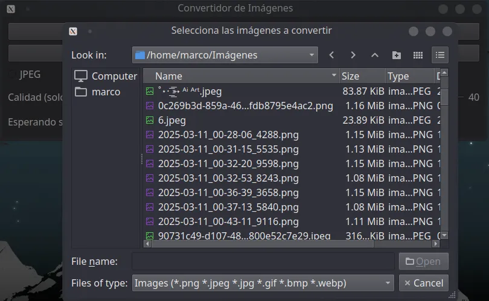
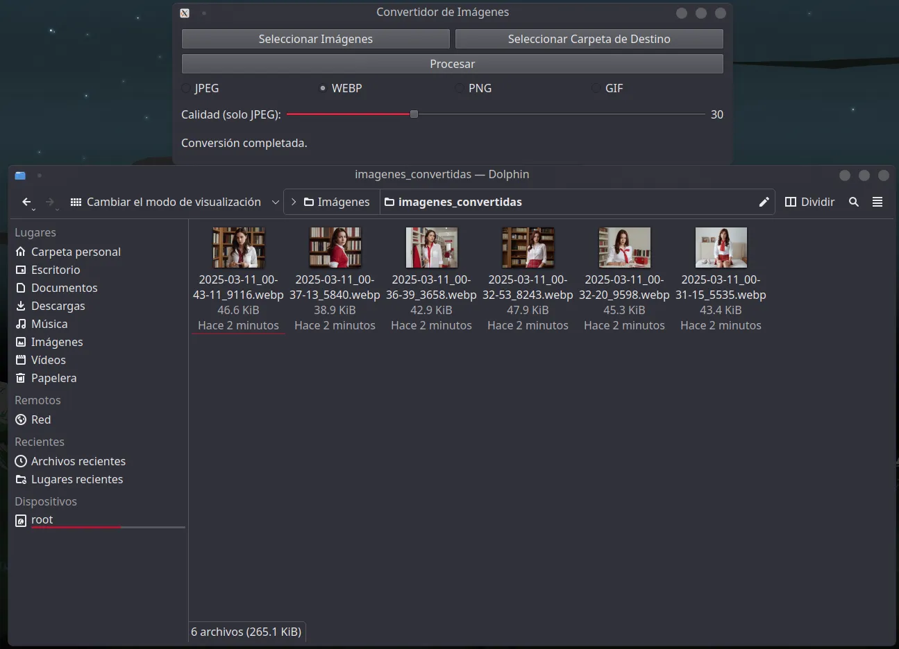

### Image Conversor

Esta aplicación es una solución que me ayudo a mejorar mi flujo de trabajo
ya que cuando necesitaba modificar la extension de una imagen y su peso 
solia utilizar GIMP que es una de las mejores herramientas de edición de imágenes
pero cuando lo unico que quieres hacer es por ejemplo cambiar de jpeg a png. 
Si es una imágen  o dos o tres no hay tanto problema, pero si son mas de 10 
se convierte en algo tedioso y aburrido.

Entonces esta aplicación que hice con Python y Pyqt6 me ayudo bastante y es mucho más rápido.

📋 Descripción
Image Converter es una aplicación de escritorio desarrollada para optimizar mi flujo de trabajo con imágenes. Mientras que herramientas como GIMP ofrecen capacidades completas de edición, a menudo necesitamos simplemente convertir formatos o reducir el peso de múltiples imágenes de manera rápida.
Esta aplicación resuelve exactamente ese problema: permite convertir entre formatos comunes (JPEG, PNG, WebP) y ajustar la calidad de compresión con una interfaz sencilla e intuitiva, ahorrando tiempo significativo cuando se trabaja con múltiples archivos.

## ✨ Características

* Conversión entre múltiples formatos de imagen (JPEG, PNG, WebP, etc.)
* Ajuste de calidad mediante un control deslizante intuitivo
* Procesamiento por lotes para convertir múltiples imágenes a la vez
* Interfaz gráfica limpia y fácil de usar desarrollada con PyQt6

## 🤖Tecnologias usadas:
* Python 3.10
* Pyqt6
* Pillow

## 🚀 Instalación

1. Clona el repositorio:
```bash
bash
git clone https://github.com/marco3islas/image_conversor.git
cd image_conversor
```

2. Crea y activa un entorno virtual:
```bash
python -m venv venv
# En Windows
venv\Scripts\activate

# En macOS/Linux
source venv/bin/activate
```

3. Instala las dependencias:
```bash
bash
pip install -r requirements.txt
```

4. Ejecuta la aplicación:
```bash
bash
python main.py

```
## Captura de imagenes




## 🔧 Uso

1. Abre la aplicación y selecciona una o varias imágenes usando el botón "Seleccionar Imágenes".
2. Selecciona la carpeta de destino.
3. Elige el formato de salida deseado usando los botones de radio.
4. Ajusta la calidad de la imagen con el control deslizante (para formatos que lo soporten).
5. Haz clic en "Procesar" para convertir las imágenes.
### Las imágenes convertidas se guardarán en la misma ubicación que elegiste con el nuevo formato.

🤝 Contribuciones
Las contribuciones son bienvenidas. Si encuentras algún error o tienes sugerencias para mejorar la aplicación, no dudes en abrir un issue o enviar un pull request.

📝 Licencia
Este proyecto está bajo la Licencia MIT. Consulta el archivo LICENSE para más detalles.

👨‍💻 Autor
Marco Antonio Islas

⭐️ Si encuentras útil este proyecto, ¡no dudes en darle una estrella en GitHub!
``` url
https://github.com/marco3islas/image_conversor
```


Author: 🧑 "Marco Antonio Islas"
